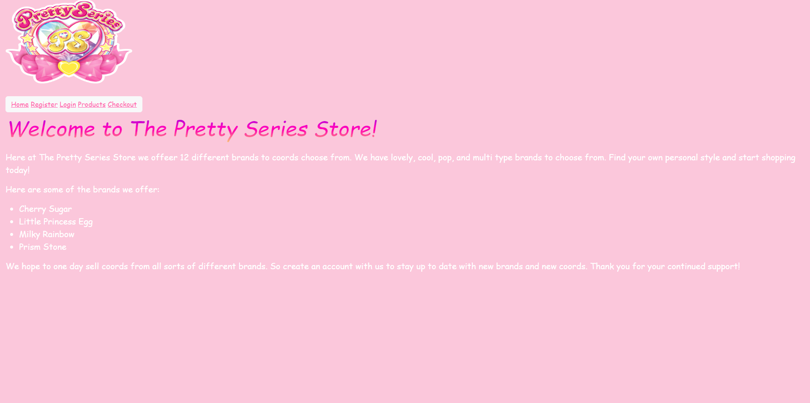
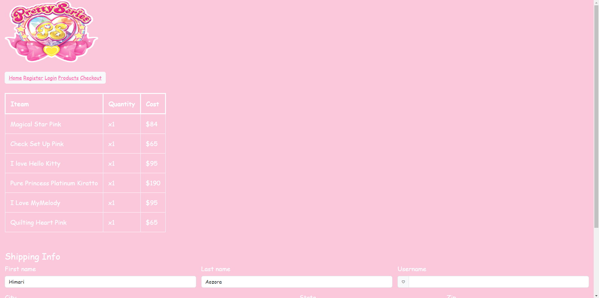

The Pretty Series Store
E-commerce Capstone 1 Project 4/18/24

Website showcasing different coords fron different brands from The Pretty Series

My most interesting piece of code would be my carousel card images.

              

                

                  

                    

                      

                        
                      

                      

                        
                      

                      

                        
                      

                    

                  

                  

                    <h5 class="card-title">Exciting Pink Jewel</h5>
                    
Type: Lovely   Rarity: Jewel Rare

                    <a href="/" class="btn btn-light">Add to cart</a>
                  

                

              

I knew what I wanted and I did my best to find a way to get it and adding a carousel to my cards was the solution. 